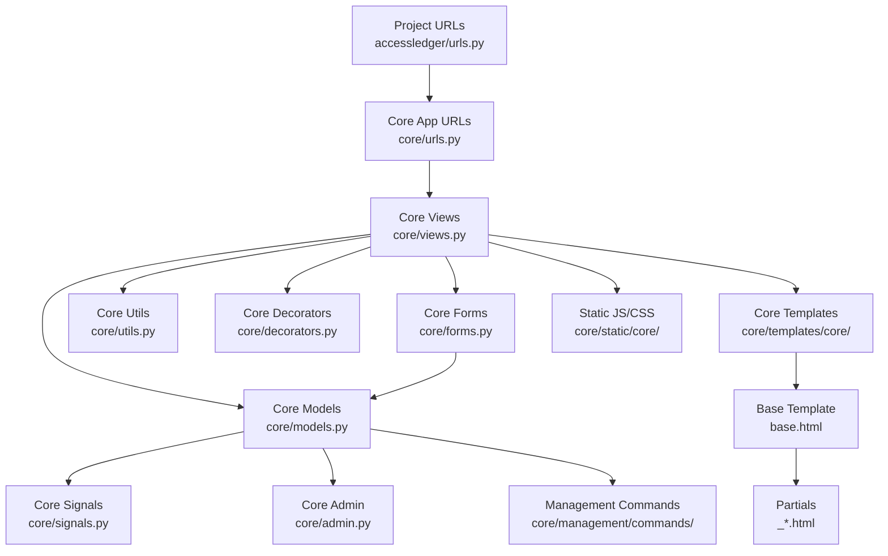
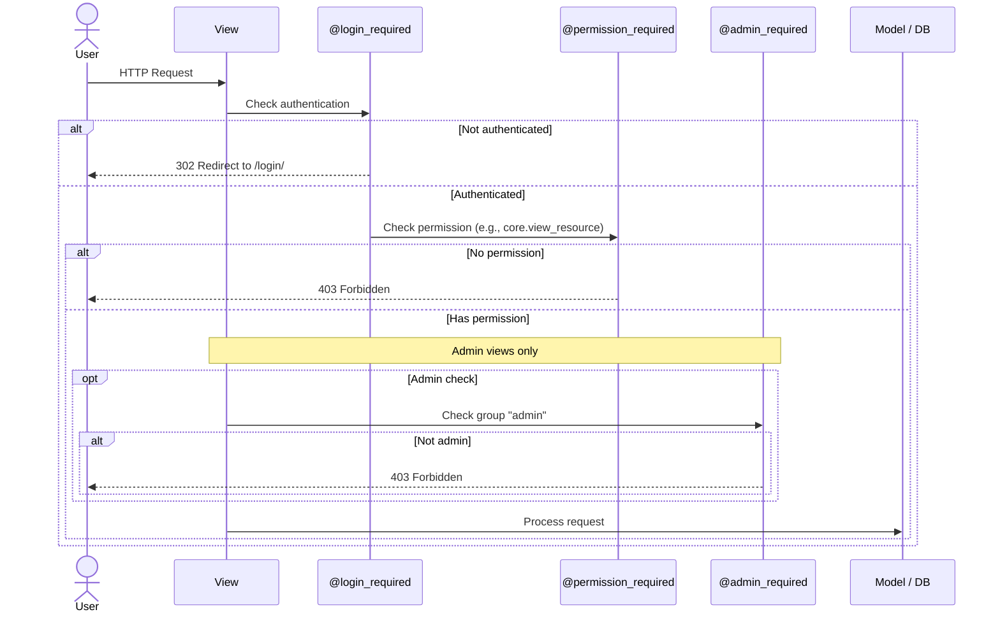
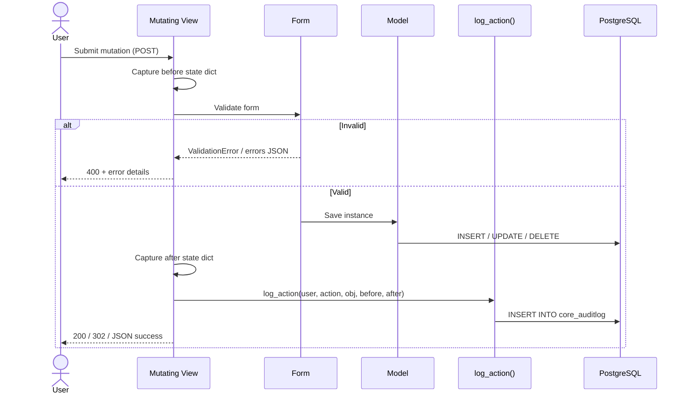
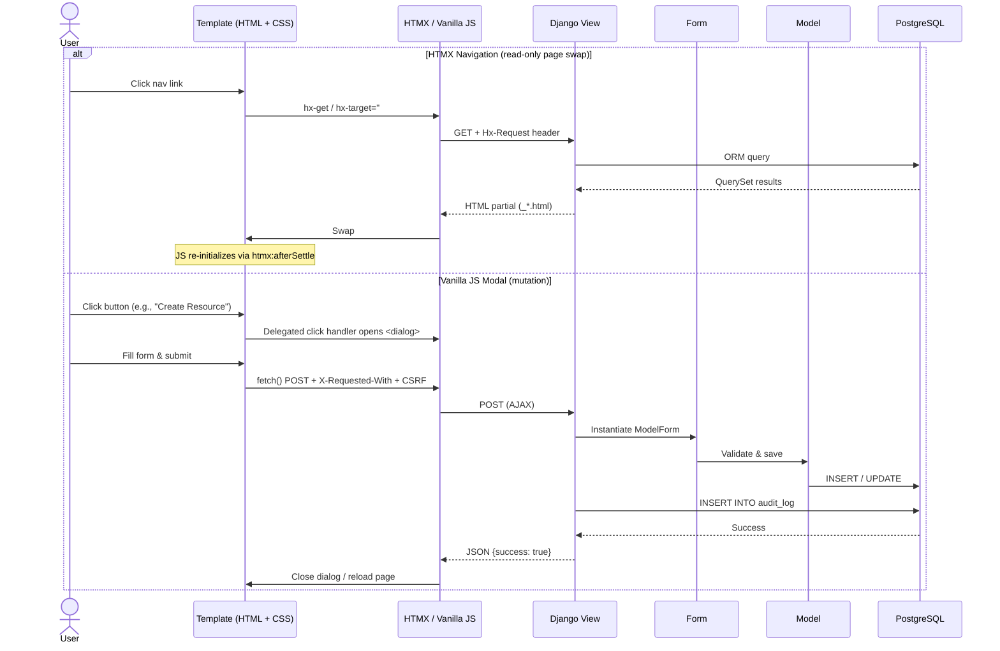

# AccessLedger Mega-Analysis

> **Change**: `mega-project-analysis`  
> **Type**: Documentation-only artifact  
> **Audience**: AI agent handoff / future maintainers  
> **Date**: 2026-06-01  
> **Source**: 10 Engram explorations (`explore-1-config` … `explore-10-business-logic`)  

---

## Executive Summary

**AccessLedger** is a Django 5.2.15 monolith that manages access grants to technology resources (servers, repositories, VPNs, SaaS, databases, dashboards). It uses a single Django app (`core`) with four models—`Resource`, `AccessGrant`, `Profile`, and `AuditLog`—backed by PostgreSQL (psycopg 3). Authentication is Django’s built-in `User` model extended via a `OneToOne` `Profile` that forces a password change on first login. Authorization is group-based RBAC with three hardcoded roles (`viewer`, `editor`, `admin`) and two custom model permissions (`can_grant_access`, `can_revoke_access`). The UI is a dark-minimal, vanilla-JavaScript + HTMX hybrid: HTMX handles SPA-style page swaps (`hx-target="#main"`), while CRUD mutations are driven by delegated event handlers on `#main` that open native `<dialog>` modals and submit via `fetch()`. Static files are served by WhiteNoise, and the production target is Railway (though several config defaults still reference Render).

The most important operational risks are: **(1)** the absence of object-level permissions means any `editor` can modify or delete any `Resource`, regardless of ownership; **(2)** no pagination, filtering, or caching on list views (`resource_list`, `audit_log`, `user_management`) creates predictable performance bottlenecks; **(3)** critical security gaps including a missing Content-Security-Policy, misconfigured `CSRF_TRUSTED_ORIGINS`, and a Dockerfile that runs as root; **(4)** the management command `expire_grants` silently marks grants as `expired` without writing to `AuditLog`, breaking the otherwise comprehensive audit trail. These issues are documented in detail in the Risk Matrix (Section 11) and should be addressed before the application scales beyond its current demo-sized footprint.

---

## 1. Project Configuration & Settings

### Key Facts

| Fact | Detail | Source |
|------|--------|--------|
| Django version | 5.2.15 | `settings.py` |
| Python version | 3.12 | `Dockerfile` |
| Database | PostgreSQL 16 (psycopg 3.3.2) | `settings.py`, `docker-compose.yml` |
| Static files | WhiteNoise 6.12 (`CompressedStaticFilesStorage`) | `settings.py` |
| Environment loader | `python-dotenv` 1.2.1 | `settings.py` |
| Rate limiting | `django-axes` 8.3.1 (5 failures / 1h cooloff) | `settings.py` |
| HTMX integration | `django-htmx` 1.23.0 | `settings.py` |
| Test runner | `pytest` 9.0.2 + `pytest-django` + `pytest-cov` | `pytest.ini` |
| CI | GitHub Actions (`ubuntu-latest`, PostgreSQL 16 service) | `.github/workflows/ci.yml` |
| Deployment target | Railway (inferred from `Procfile` and README) | `Procfile` |
| `CSRF_TRUSTED_ORIGINS` default | `https://*.onrender.com` | `settings.py` |

### Patterns & Architecture

- **Single-app monolith**: All domain logic lives in the `core` app. There are no additional Django apps.
- **Settings split**: `accessledger/settings.py` (prod/dev), `accessledger/settings_test.py` (CI/test overrides). Tests set `AXES_ENABLED = False`.
- **Middleware stack** (order matters):
  ```
  SecurityMiddleware → WhiteNoiseMiddleware → SessionMiddleware → CommonMiddleware
  → CsrfViewMiddleware → AuthenticationMiddleware → MessageMiddleware
  → XFrameOptionsMiddleware → ForcePasswordChangeMiddleware → AxesMiddleware → HtmxMiddleware
  ```
  `ForcePasswordChangeMiddleware` is custom and sits after auth but before axes/htmx.
- **Environment variables**: All secrets (`SECRET_KEY`, `POSTGRES_PASSWORD`) are read via `os.environ.get()` with `python-dotenv`. `DEBUG` defaults to `False`.
- **No CORS, no MEDIA, no cache backend**: The project does not configure `django-cors-headers`, `MEDIA_URL`, or a cache backend (`CACHES`).

### Notable Risks

- **CRITICAL** `CSRF_TRUSTED_ORIGINS` default points to `*.onrender.com`, not Railway. If the env var is unset in production, CSRF validation will reject legitimate requests from the Railway domain (`*.up.railway.app`). *Evidence*: `settings.py` lines 103–106. *Recommendation*: Update the default to `https://*.up.railway.app` or remove the default and make the variable mandatory.
- **HIGH** No caching backend configured. Every request hits the database uncached. *Evidence*: `CACHES` is absent from `settings.py`. *Recommendation*: Add `django-redis` or `django-cacheops` for template fragment and query caching.
- **MEDIUM** `POSTGRES_USER` default is `danidev_dj` (developer-specific). *Evidence*: `settings.py`. *Recommendation*: Remove the default and require the variable.
- **MEDIUM** No `CONN_MAX_AGE` or connection pooling. Each HTTP request opens and closes a fresh TCP connection to PostgreSQL. *Evidence*: `DATABASES` in `settings.py`. *Recommendation*: Set `CONN_MAX_AGE=60` or introduce `pgbouncer`.

---

## 2. Core Models & Database

### Key Facts

| Fact | Detail | Source |
|------|--------|--------|
| Models | 4 (`Resource`, `AccessGrant`, `Profile`, `AuditLog`) | `core/models.py` |
| Custom managers | 0 | `core/models.py` |
| Signals | 1 (`post_save` on `User` → auto-create `Profile`) | `core/signals.py` |
| Migrations | 6 (evolutionary: MVP → permissions → Profile → AuditLog → choice fix → index) | `core/migrations/` |
| Admin registration | `Resource` and `AccessGrant` only | `core/admin.py` |
| Unique constraints | `Resource.name` (unique), `Profile.user` (OneToOne implicit) | `core/models.py` |
| Database indexes | 4 explicit (`AccessGrant` composite on `(user, resource)`, `AccessGrant.end_at`, `AuditLog.timestamp`, `Resource.name` implicit unique) | `core/models.py`, migrations |

### Patterns & Architecture

- **Profile extension pattern**: `Profile` extends `User` via `OneToOneField(User, on_delete=CASCADE)` with `must_change_password = BooleanField(default=True)`. Creation is guaranteed by a `post_save` signal (`core/signals.py`), connected in `CoreConfig.ready()` (`core/apps.py`).
- **Generic reference (manual)**: `AuditLog` does not use Django’s `GenericForeignKey`; it stores `object_type` (model name string) + `object_id` (`PositiveIntegerField`). This avoids coupling to `django.contrib.contenttypes` but sacrifices referential integrity and ORM-assisted lookups.
- **RBAC permissions in model Meta**: `AccessGrant` defines two custom permissions (`can_grant_access`, `can_revoke_access`) inside `class Meta`. These are assigned to the `admin` group by the `bootstrap_roles` management command.
- **Admin optimizations**: Both `ResourceAdmin` and `AccessGrantAdmin` use `list_select_related`, `autocomplete_fields`, and cross-model `list_filter`/`search_fields` to avoid N+1 queries.

### Notable Risks

- **CRITICAL** `AuditLog` lacks indexes on `(object_type, object_id)` and `(action, timestamp)`. Queries such as *"show me all logs for Resource #5"* or *"all user creations in the last week"* will perform full sequential scans as the table grows. *Evidence*: `core/models.py` `AuditLog` definition, migration `0004_auditlog`. *Recommendation*: Add `Meta.indexes` and generate a migration.
- **HIGH** Foreign key columns (`Resource.owner`, `AccessGrant.user`, `AccessGrant.resource`, `AuditLog.user`) do not declare `db_index=True`. While some databases create implicit indexes on FKs, Django’s documentation is ambiguous; without explicit indexes, JOINs may degrade. *Evidence*: `core/models.py`. *Recommendation*: Add `db_index=True` to all FK fields used in filtering or JOINs.
- **HIGH** No soft-delete pattern. Deleted `Resource` and `AccessGrant` rows are permanently removed (only `Resource.is_active` approximates soft-delete for resources). Grants can be `revoked`, but there is no `deleted_at` or `is_deleted` flag for audit reconstruction. *Evidence*: Model definitions. *Recommendation*: Introduce a `SoftDeleteModel` base class or use `django-safedelete` if recovery is a requirement.
- **MEDIUM** `AccessGrant.status` is not indexed. The application likely filters by `status="active"` frequently, yet no B-tree exists on this column. *Evidence*: `core/models.py`. *Recommendation*: Add `db_index=True` to `status`.
- **MEDIUM** `Resource` lacks `Meta.ordering`. Without an explicit `order_by()`, query result order is undefined. *Evidence*: `core/models.py`. *Recommendation*: Add `ordering = ["name"]` or `["-updated_at"]`.
- **LOW** `Profile` does not define `__str__`, making debugging and admin readability poor. *Evidence*: `core/models.py`. *Recommendation*: Add `__str__` returning `f"Profile({self.user.username})"`.

---

## 3. Core Views

### Key Facts

| Fact | Detail | Source |
|------|--------|--------|
| Total views | 16 (15 FBVs + 1 CBV `CustomPasswordChangeView`) | `core/views.py` |
| Decorator pattern | `@login_required` (outer) + `@permission_required` / `@admin_required` (inner) | `core/views.py` |
| HTMX-aware views | 4 (`resource_list`, `user_profile`, `user_management`, `audit_log`) | `core/views.py` |
| AJAX/JSON views | 9 (use `X-Requested-With` header) | `core/views.py` |
| Pagination | None on any list view | `core/views.py` |
| Filtering / search | None | `core/views.py` |

### Patterns & Architecture

- **Dual-response pattern (AJAX vs normal)**: Views such as `resource_create`, `resource_update`, `grant_create`, `user_create`, and `user_update` detect AJAX via `request.headers.get("X-Requested-With") == "XMLHttpRequest"`. On success they return `JsonResponse({"success": True})` for AJAX or a `redirect()` for normal requests. On invalid form they return `JsonResponse({"success": False, "errors": form.errors})` for AJAX or re-render the template for normal requests. `GET` AJAX requests are rejected with `HttpResponseNotAllowed(["POST"])` (405).
- **HTMX partial pattern**: The four HTMX-aware views check `request.htmx` (provided by `django-htmx`) and return a partial template (`core/_*.html`) instead of the full page (`core/*.html`). The full page extends `base.html` and `` the same partial, ensuring consistency.
- **Audit logging on every mutation**: All mutating views capture a `before` dict, perform the action, capture an `after` dict, and call `log_action()` from `core/utils.py`. This includes `resource_create`, `resource_update`, `resource_delete`, `grant_create`, `grant_revoke`, `user_toggle_active`, `user_create`, and `user_update`.
- **Form-field hiding**: Sensitive/assigned fields (`owner`, `resource`, `status`) are excluded from `ModelForm` Meta.fields and assigned manually in the view. This prevents users from tampering with ownership or status.

### Notable Risks

- **CRITICAL** `grant_revoke` accepts `GET` and performs a side effect (revocation). While idempotent (revoking an already revoked grant is a no-op), this violates HTTP semantics and allows accidental revocation via crawlers, prefetching, or malicious links. *Evidence*: `core/views.py` `grant_revoke`; URL `grants/<int:pk>/revoke` (note missing trailing slash). *Recommendation*: Decorate with `@require_POST` and return 405 for GET.
- **HIGH** `admin_required` hardcodes the group name `"admin"` as a magic string. If the group is ever renamed (e.g., during localization), all admin views become unreachable without a code change. *Evidence*: `core/decorators.py`. *Recommendation*: Replace with a setting or a permission check.
- **HIGH** No pagination on `resource_list`, `audit_log`, and `user_management`. As data grows, these views will load the entire table into memory and serialize it to HTML. *Evidence*: Queries use `.all()` with `.order_by(...)` but no `.paginate()`. *Recommendation*: Introduce `django.core.paginator.Paginator` or `django-filter`.
- **HIGH** `CustomPasswordChangeView` assumes the user always has a `Profile`. If a user is created outside the signal path (e.g., raw SQL, bulk import), accessing `request.user.profile` raises `RelatedObjectDoesNotExist` and returns HTTP 500. *Evidence*: `core/views.py` lines 259–265. *Recommendation*: Use `getattr` or `Profile.objects.get_or_create` in `form_valid`.
- **MEDIUM** Two distinct AJAX-detection mechanisms coexist: `request.htmx` (for partial templates) and `X-Requested-With` (for JSON form submissions). This inconsistency increases cognitive load and the chance of mis-routing a request. *Evidence*: `core/views.py` (multiple views). *Recommendation*: Unify on `request.htmx` for all AJAX-like requests, or standardize on a single header.
- **MEDIUM** `user_toggle_active` does not prevent an admin from deactivating themselves. If the sole admin disables their own account, the system becomes unmanageable without database intervention. *Evidence*: `core/views.py` `user_toggle_active`. *Recommendation*: Add a guard: `if user == request.user: return JsonResponse({"success": False, "error": "..."}, status=400)`.
- **LOW** `grant_revoke` URL pattern lacks a trailing slash (`grants/<int:pk>/revoke`), inconsistent with every other route. Django’s `APPEND_SLASH=True` will redirect, but it is a needless asymmetry. *Evidence*: `core/urls.py`. *Recommendation*: Add the trailing slash.

---

## 4. Templates & HTMX Patterns

### Key Facts

| Fact | Detail | Source |
|------|--------|--------|
| Total templates | 18 HTML files | `core/templates/core/`, `templates/registration/`, `templates/axes/` |
| Base template | `core/base.html` (extended by 10 templates) | `core/templates/core/base.html` |
| Partials | 4 (`_resource_table.html`, `_user_management.html`, `_user_profile.html`, `_audit_log.html`) | `core/templates/core/` |
| HTMX version | 2.0.4 (CDN unpkg) | `core/templates/core/base.html` |
| Modals | 6+ native `<dialog>` elements | Multiple templates |
| Custom template tags | 0 | Template audit |

### Patterns & Architecture

- **Full-page / partial duality**: The base layout (`base.html`) renders the chrome (topbar, nav). HTMX swaps only `#main`, which contains the partial. When a user navigates directly (or refreshes), the view returns the full page that `` the same partial. This gives SPA-like speed without a JavaScript framework.
- **HTMX navigation only**: HTMX is **not** used for form submissions or modal dialogs. It is strictly for `hx-get` links that swap `#main` and push history (`hx-push-url="true"`). All CRUD operations use vanilla JavaScript `fetch()` inside `<dialog>` modals.
- **Conditional navigation**: Links to *Users* and *Audit Log* are wrapped in ``. This uses the `delete_resource` permission as a proxy for admin status, which happens to work because only the `admin` group has that permission, but it is semantically imprecise.
- **Password strength UI**: `password_change_form.html` includes a 3-bar visual indicator driven by `password_change.js`, with inline criteria hints.
- **Form rendering**: Fields are rendered manually (`{{ form.field }}`) with explicit `<label for="{{ form.field.id_for_label }}">` and `{{ form.field.errors }}`. No `crispy_forms` or `django-widget-tweaks`.

### Notable Risks

- **MEDIUM** Inline script injection in `password_change_form.html`:  
  ```html
  <script>const USERNAME = "{{ request.user.username }}";</script>
  ```
  This injects a raw Django variable into a JavaScript context without the `|escapejs` filter. Although Django usernames are restricted characters, this is a latent XSS vector if the restriction ever changes. *Evidence*: `templates/registration/password_change_form.html`. *Recommendation*: Use `|escapejs` or load the username via a `data-*` attribute.
- **MEDIUM** Inline CSS styles are present in 6 templates (`resource_detail`, `resource_create`, `resource_update`, `resource_delete`, `grant_create`, `lockout`), violating separation of concerns and making theme maintenance harder. *Evidence*: Template audit. *Recommendation*: Move all styles to the dedicated CSS files.
- **LOW** No Content-Security-Policy means inline scripts and styles are not mitigated by the browser even if they exist. *Evidence*: Security analysis (Section 9). *Recommendation*: Implement a CSP and move inline code to external files.

---

## 5. JavaScript Architecture

### Key Facts

| Fact | Detail | Source |
|------|--------|--------|
| JS files | 3 (`app.js`, `delegated.js`, `password_change.js`) | `core/static/core/js/` |
| Total JS lines | ~777 (app.js 67, delegated.js 644, password_change.js 66) | File audit |
| Module pattern | IIFE in `app.js` and `delegated.js`; global scope in `password_change.js` | `core/static/core/js/` |
| AJAX library | 100% `fetch()` (zero `XMLHttpRequest`) | `core/static/core/js/delegated.js` |
| HTMX events used | `htmx:afterSettle` only | `app.js`, `delegated.js` |
| Third-party JS | HTMX 2.0.4 (CDN) | `base.html` |

### Patterns & Architecture

- **Event delegation on `#main`**: `delegated.js` attaches a single listener to `#main` for `click`, `submit`, and `input` events. Individual handlers use `e.target.closest(selector)` to match dynamic elements. This pattern survives HTMX swaps because `#main` itself is never removed—only its children are replaced.
- **Direct backdrop listeners on `<dialog>`**: Because `stopPropagation()` inside dialogs can interfere with delegation, each dialog’s backdrop gets a direct `click` listener (guarded by `_alBackdropAttached` to prevent duplicate attachments). These are re-attached in `htmx:afterSettle`.
- **Re-initialization after HTMX swap**: Both `app.js` (nav active state) and `delegated.js` (backdrop + search counts) listen to `htmx:afterSettle` to re-run initialization logic after partial content loads.
- **XSS-safe DOM insertion**: `delegated.js` defines `escapeHtml()` using `document.createTextNode()` + `textContent`. User-generated content is never inserted via `innerHTML` unsanitized.
- **Generic fetch wrapper (`submitForm`)**: A helper that reads the CSRF token from the cookie, builds `FormData`, sends `fetch(...)` with `X-Requested-With: XMLHttpRequest`, and normalizes success/error/network callbacks.
- **Deferred script loading**: All scripts (`app.js`, `delegated.js`, HTMX) are loaded with `defer` in `base.html`, guaranteeing DOM readiness without `DOMContentLoaded` listeners.

### Notable Risks

- **MEDIUM** `password_change.js` runs in the global scope (no IIFE). If another script defines a conflicting variable, behavior is undefined. *Evidence*: `core/static/core/js/password_change.js`. *Recommendation*: Wrap in an IIFE or ES module.
- **MEDIUM** `password_change.js` depends on a global `USERNAME` constant injected inline by the template. If the template forgets to inject it, the script crashes with `ReferenceError`. *Evidence*: `password_change_form.html` inline script. *Recommendation*: Pass the username via a `data-username` attribute on the password input and read it from `dataset`.
- **LOW** No client-side error tracking (Sentry, LogRocket, etc.). Network failures in `fetch()` are caught and logged to console, but not reported anywhere. *Evidence*: `delegated.js` catch blocks. *Recommendation*: Add a lightweight logging endpoint or integrate an error-tracking SDK.

---

## 6. CSS & Styling

### Key Facts

| Fact | Detail | Source |
|------|--------|--------|
| CSS files | 5 (`app.css`, `auth.css`, `audit_log.css`, `user_management.css`, `user_profile.css`) | `core/static/core/css/` |
| Total CSS lines | ~1,894 | File audit |
| Design system | Custom dark-minimal, 11 CSS custom properties in `:root` | `core/static/core/css/app.css` |
| External frameworks | 0 | File audit |
| Naming convention | BEM-like (`Block__Element--Modifier`) | `core/static/core/css/` |
| Breakpoints | 4 (`820px`, `768px`, `520px`, `480px/420px`) | CSS audit |
| Conditional loading | `user_management.css` + `audit_log.css` only for users with `delete_resource` permission; `user_profile.css` only for authenticated users | `base.html` |

### Patterns & Architecture

- **CSS custom properties theming**: Colors, spacing, and typography are centralized in `:root` variables, making dark-mode maintenance straightforward.
- **Component library (custom)**: Reusable classes for `topbar`, `nav` (with CSS-only hamburger), `card`, `modal` (native `<dialog>`), `toggle-switch`, `badge` (7 semantic variants), and `table` (hover rows).
- **Animation safety**: Keyframe animations respect `prefers-reduced-motion`. The login tilt effect in `app.js` also checks `pointer: coarse` to avoid taxing mobile devices.
- **No build step**: CSS is handwritten and served raw by WhiteNoise. There is no minification, PostCSS, or Tailwind.

### Notable Risks

- **MEDIUM** Inline styles in 6 templates (noted in Section 4) bypass the custom-property system and complicate visual consistency. *Evidence*: `resource_detail.html`, `resource_create.html`, etc. *Recommendation*: Extract inline styles to `app.css` or a new component class.
- **LOW** No `@media print` styles. Printing an audit log or resource list will include navigation chrome and dark backgrounds, wasting ink. *Recommendation*: Add a print media query that hides `topbar` and forces light backgrounds.
- **LOW** No CSS minification or bundling. WhiteNoise compresses with gzip/brotli, but the browser still parses ~1,900 lines of CSS on every page. *Recommendation*: Add a build step (e.g., `cssnano`) or at least concatenate files to reduce HTTP requests.

---

## 7. Tests & Testing Infrastructure

### Key Facts

| Fact | Detail | Source |
|------|--------|--------|
| Test framework | `pytest` 9.0.2 + `pytest-django` 4.12.0 | `pytest.ini` |
| Coverage tool | `pytest-cov` 7.0.0 (installed but not configured in `addopts`) | `pytest.ini` |
| Factory library | `factory_boy` 3.3.3 (installed but **unused** in any test) | `tests/` audit |
| Fixtures | 3 (`viewer_client`, `editor_client`, `admin_client`) in `conftest.py` | `conftest.py` |
| Total tests | 34 (models: 6, views: 24, forms: 6) | `tests/` audit |
| Test DB | Shared with development (`accessledger` or env-configured DB) | `settings_test.py` |

### Patterns & Architecture

- **Role-based fixture pyramid**: Each fixture creates a `Group`, assigns the correct permissions, creates a `User`, logs the user in via the test client, and yields the authenticated client. This gives each test a pre-configured RBAC context.
- **Direct ORM creation**: Tests use `Model.objects.create()` and `ModelForm(data=...)` directly; no factories, no `faker`, no ` mommy`. This is verbose but explicit.
- **No mocking**: All tests hit the real database and real view code. There are no `unittest.mock` patches.
- **RBAC coverage is strong**: The view tests verify that `viewer` gets 403 on create/delete, `editor` can add/change but not delete, and `admin` can do everything. This is the most valuable part of the test suite.
- **AuditLog tests are exhaustive**: 12 tests cover create/delete/update diffs, HTMX partial responses, and edge cases (missing fields, invalid forms).

### Notable Risks

- **HIGH** 8 of 16 views are completely untested: `resource_detail`, `resource_update`, `resource_data`, `user_list`, `user_management`, `user_toggle_active`, `user_data`, and `user_update` (POST). *Evidence*: `tests/test_views.py` audit. *Recommendation*: Add at least smoke tests for each untested view, focusing on permissions and happy-path rendering.
- **HIGH** `UserForm` and `UserCreateForm` have zero unit tests. The only form tests are for `AccessGrantForm` (date validation) and `ResourceForm` (duplicate name). *Evidence*: `tests/test_forms.py`. *Recommendation*: Add tests for `UserForm` group assignment logic and `UserCreateForm` password hashing.
- **HIGH** Tests run against the **same PostgreSQL database** as development. `settings_test.py` does not override `NAME` to a separate test database. Running tests locally will truncate or mutate development data. *Evidence*: `settings_test.py`. *Recommendation*: Force `NAME = "test_accessledger"` in `settings_test.py`.
- **MEDIUM** `factory_boy` is a dead dependency. It increases installation time and attack surface without providing value. *Evidence*: `requirements.txt` vs `tests/` audit. *Recommendation*: Remove `factory_boy` and `Faker` from `requirements.txt`, or adopt them to reduce boilerplate.
- **MEDIUM** No integration or end-to-end tests. There are no tests that exercise a full user journey (e.g., create resource → create grant → revoke grant → verify audit log). *Evidence*: Test suite audit. *Recommendation*: Add a single integration test class that walks through the happy path.
- **MEDIUM** `pytest-cov` is installed but `--cov` is not in `pytest.ini` `addopts`. Coverage is never generated in CI. *Evidence*: `pytest.ini`. *Recommendation*: Add `--cov=core --cov-report=term-missing` to `addopts`.

---

## 8. Auth, Authorization & Security

### Key Facts

| Fact | Detail | Source |
|------|--------|--------|
| User model | Default `django.contrib.auth.models.User` (no `AUTH_USER_MODEL` override) | `settings.py` |
| Profile extension | `core.models.Profile` (OneToOne, `must_change_password`) | `core/models.py` |
| Auth backends | `AxesStandaloneBackend` → `ModelBackend` | `settings.py` |
| Groups / roles | `viewer`, `editor`, `admin` | `bootstrap_roles.py` |
| Custom permissions | `can_grant_access`, `can_revoke_access` on `AccessGrant` | `core/models.py` |
| Decorator stack | `@login_required` + `@permission_required(..., raise_exception=True)` / `@admin_required` | `core/views.py`, `core/decorators.py` |
| Session security | `SESSION_COOKIE_SECURE = True`, `CSRF_COOKIE_SECURE = True` (prod only) | `settings.py` |
| HSTS | `SECURE_HSTS_SECONDS = 31536000`, `SECURE_HSTS_INCLUDE_SUBDOMAINS = True` | `settings.py` |
| Rate limiting | `django-axes`: 5 failures, 1h cooloff | `settings.py` |
| Password validators | 4 built-in (length ≥8, common, numeric, similarity) | `settings.py` |
| Password reset | **Not implemented** | Full codebase search |
| CSP | **Not configured** | `settings.py` audit |

### Patterns & Architecture

- **Double-gate authorization**: Every view is wrapped in `@login_required` (auth check) followed by `@permission_required` or `@admin_required` (authz check). `raise_exception=True` prevents redirect loops for already-authenticated users lacking permission.
- **Force-password-change middleware**: `ForcePasswordChangeMiddleware` intercepts every authenticated request. If `profile.must_change_password` is `True` and the path is not in `ALLOWED_PATHS` (`/password/change/`, `/login/`, `/admin/`), it redirects to the password change view. This ensures first-login compliance.
- **Custom password change view**: `CustomPasswordChangeView` (CBV extending Django’s `PasswordChangeView`) resets `must_change_password = False` on successful validation and redirects to `resource_list`.
- **Rate limiting with django-axes**: `AxesStandaloneBackend` is placed first in `AUTHENTICATION_BACKENDS`. After 5 failed login attempts from a given username+IP, the account is locked for 1 hour. The lockout template (`axes/lockout.html`) uses a generic message to prevent user enumeration.
- **Logout requires POST**: `LogoutView` is invoked via a form with `` in `base.html`, preventing CSRF logout attacks.

### Notable Risks

- **CRITICAL** No Content-Security-Policy (CSP). Without a CSP, XSS vulnerabilities are significantly harder to mitigate because the browser will execute any injected script. *Evidence*: `settings.py` lacks `CSP_DEFAULT_SRC` or middleware. *Recommendation*: Add `django-csp` and configure a strict policy (default-src 'self'; script-src 'self' unpkg.com; style-src 'self' 'unsafe-inline' if needed).
- **CRITICAL** No object-level permissions. Any user with `change_resource` can edit *any* resource, not just their own. The `owner` field is informational, not enforced. Similarly, `can_revoke_access` allows revoking any grant, not just those created by the user. *Evidence*: `core/views.py` (no `owner == request.user` check). *Recommendation*: Implement Django Guardian or add manual ownership checks in views.
- **HIGH** Missing security headers: `SECURE_BROWSER_XSS_FILTER`, `SECURE_CONTENT_TYPE_NOSNIFF`, and `SECURE_REFERRER_POLICY` are not set. *Evidence*: `settings.py` audit. *Recommendation*: Add `SECURE_CONTENT_TYPE_NOSNIFF = True` and `SECURE_BROWSER_XSS_FILTER = True`.
- **HIGH** No password reset flow. Users who forget their password must contact an admin; there is no self-service mechanism. *Evidence*: Full search for `password_reset` returns zero results. *Recommendation*: Add Django’s built-in `PasswordResetView` URLs and templates.
- **HIGH** Dockerfile runs as `root`. If the container is compromised, the attacker has root privileges. *Evidence*: `Dockerfile` has no `USER` directive. *Recommendation*: Create a non-root user (`groupadd -r app && useradd -r -g app app`) and switch to it before `CMD`.
- **MEDIUM** `admin_required` hardcodes the string `"admin"`. Renaming the group silently breaks admin access. *Evidence*: `core/decorators.py`. *Recommendation*: Replace with a permission-based check or a settings constant.
- **MEDIUM** CSRF token for HTMX requests is not explicitly configured in JavaScript. Django’s `CsrfViewMiddleware` requires the token on POST/PUT/DELETE. HTMX does not automatically read the cookie and set the header unless `htmx.config.includeIndicator` or a custom header is added. In practice, the application may work if HTMX reads the `csrftoken` cookie, but this is fragile. *Evidence*: No CSRF header setup found in JS files. *Recommendation*: Ensure `htmx:afterSettle` or a global listener adds `X-CSRFToken` from the cookie to HTMX requests.
- **LOW** Username injected into inline JavaScript without `|escapejs`. *Evidence*: `password_change_form.html`. *Recommendation*: Use `|escapejs` or move the value to a `data-*` attribute.

---

## 9. Deployment & Infrastructure

### Key Facts

| Fact | Detail | Source |
|------|--------|--------|
| Container image | `python:3.12-slim` (single-stage) | `Dockerfile` |
| Compose services | `db` (postgres:16), `web` (build: .) | `docker-compose.yml` |
| Web server (prod) | Gunicorn 25.1.0 (WSGI) | `entrypoint.sh`, `Procfile` |
| Gunicorn workers | Default (1 sync worker) | `entrypoint.sh` |
| Gunicorn config file | None | Project audit |
| Static files | WhiteNoise (`CompressedStaticFilesStorage`) | `settings.py` |
| Hosting | Railway (`Procfile` present) | `Procfile`, README |
| Production URL | `https://web-production-0ea6.up.railway.app` | README |
| CI/CD | GitHub Actions: pytest only, no deploy/lint/security jobs | `.github/workflows/ci.yml` |
| Healthcheck | None on `web` service | `docker-compose.yml` |
| DB connection pooling | None | `settings.py` |

### Patterns & Architecture

- **Entrypoint script (`entrypoint.sh`)**: Handles `collectstatic --noinput --clear`, `migrate`, and optionally runs `bootstrap_roles` + `seed_data` in the background. Server mode is conditional: `runserver` when `DEBUG=True`, `gunicorn` when `DEBUG=False`.
- **Procfile for Railway**: `web: gunicorn accessledger.wsgi --log-file -`. Railway detects the Procfile automatically; no `railway.toml` is present.
- **Docker layer caching**: `requirements.txt` is copied before the rest of the codebase, so `pip install` is cached unless dependencies change.
- **Environment-driven configuration**: All runtime config is externalized to env vars (see Section 1 table).

### Notable Risks

- **CRITICAL** `CSRF_TRUSTED_ORIGINS` default points to Render (`*.onrender.com`), not Railway. If the env var is missing in production, HTMX POSTs and AJAX requests from the Railway domain will fail with 403. *Evidence*: `settings.py` lines 103–106. *Recommendation*: Change default to `https://*.up.railway.app` or make the variable required.
- **HIGH** Gunicorn uses a single sync worker with default timeout (30s). Under any real load, this will queue requests and degrade latency. There is no `gunicorn.conf.py` or worker tuning. *Evidence*: `entrypoint.sh`, `Procfile`. *Recommendation*: Create `gunicorn.conf.py` with `workers = 2-4 × CPU cores`, `worker_class = "sync"` (or `gevent` for I/O-bound), `keepalive`, and `max_requests`.
- **HIGH** No database connection pooling. Each HTTP request opens a new PostgreSQL connection. *Evidence*: `DATABASES` in `settings.py` lacks `CONN_MAX_AGE`. *Recommendation*: Set `CONN_MAX_AGE=60` or deploy `pgbouncer`.
- **HIGH** No caching layer. No Redis, Memcached, or Django cache backend. Repeated list views hit the DB on every request. *Evidence*: `settings.py`. *Recommendation*: Add `django-redis` and cache the output of `resource_list`, `audit_log`, and `user_management` for short TTLs.
- **MEDIUM** `web` service in `docker-compose.yml` has no `healthcheck`. Docker cannot detect if the application crashes after startup. *Evidence*: `docker-compose.yml`. *Recommendation*: Add a `healthcheck` using `curl -f http://localhost:8000/health/` or Django’s `django-health-check`.
- **MEDIUM** CI only runs tests. There is no linting (`ruff`, `black`), type checking (`mypy`), security scanning (`bandit`, `pip-audit`), or Docker build verification. *Evidence*: `.github/workflows/ci.yml`. *Recommendation*: Expand the workflow with `ruff check .`, `bandit -r .`, and `docker build .`.
- **MEDIUM** Single-stage Dockerfile includes source code, tests, and potential `.git` history (though `.dockerignore` excludes `.git/`). The final image is larger than necessary. *Recommendation*: Use a multi-stage build or at least add a `.dockerignore` for `tests/`, `.github/`, `docs/`.
- **LOW** No CDN for static files. WhiteNoise is acceptable for low traffic, but under load the same Gunicorn process serves both dynamic and static requests. *Recommendation*: Offload statics to a CDN (CloudFront, Cloudflare) or at least a separate static-files domain.

---

## 10. URLs, Forms & Business Logic

### Key Facts

| Fact | Detail | Source |
|------|--------|--------|
| URL routes (project) | 6 (`/`, `/admin/`, `/login/`, `/logout/`, `/password/change/`, `/password/change/done/`) | `accessledger/urls.py` |
| URL routes (core) | 16 | `core/urls.py` |
| Total forms | 4 (`AccessGrantForm`, `ResourceForm`, `UserForm`, `UserCreateForm`) | `core/forms.py` |
| Management commands | 3 (`seed_data`, `expire_grants`, `bootstrap_roles`) | `core/management/commands/` |
| Audit utility | `log_action()` in `core/utils.py` | `core/utils.py` |
| `app_name` / namespace | **Not defined** in `core/urls.py` | `core/urls.py` |

### Patterns & Architecture

- **Clean dependency graph**: The import graph is unidirectional and acyclic:
  ```
  models.py → forms.py → views.py → urls.py
  models.py → admin.py
  models.py → signals.py
  models.py → utils.py
  views.py → decorators.py
  ```
  There are no circular imports.
- **Consistent audit logging**: Every mutating view calls `log_action(user, action, obj, before, after)`. The utility writes an `AuditLog` record with `object_type = obj.__class__.__name__`, `object_id = obj.pk`, and JSON snapshots. This creates a complete, immutable trail for all web-driven mutations.
- **Form-field abstraction**: `ResourceForm` excludes `owner` (assigned in view), `AccessGrantForm` excludes `resource` and `status` (assigned in view), and `UserForm` adds a non-model `role` field (`ModelChoiceField` to `Group`) that the view manually syncs to `user.groups`.
- **Idempotent management commands**: `bootstrap_roles` and `seed_data` use `get_or_create`, making them safe to run multiple times. `expire_grants` uses `QuerySet.update()` for atomic batch expiration.

### Notable Risks

- **HIGH** `expire_grants` does **not** write to `AuditLog`. Unlike every other mutation path, the management command performs a bulk `.update(status="expired")` without calling `log_action()`. This creates a silent gap in the audit trail. *Evidence*: `core/management/commands/expire_grants.py`. *Recommendation*: Iterate over the queryset and call `log_action(...)` for each expired grant, or add a bulk-audit helper.
- **MEDIUM** `grant_revoke` accepts `GET` (already documented in Section 3). *Evidence*: `core/views.py`. *Recommendation*: `@require_POST`.
- **MEDIUM** `UserForm.role` is a synthetic field not present on the `User` model. If `UserForm` is used in a view that forgets to call `user.groups.clear()` and `user.groups.add()`, the role selection is silently ignored. *Evidence*: `core/forms.py`, `core/views.py` `user_update`. *Recommendation*: Override `UserForm.save()` to handle group assignment, or add a custom `ModelForm` mixin.
- **MEDIUM** Inconsistent AJAX detection: HTMX partials rely on `request.htmx`, while form submissions rely on `request.headers.get("X-Requested-With") == "XMLHttpRequest"`. A future developer might mix the two and return JSON when HTML is expected. *Evidence*: `core/views.py`. *Recommendation*: Standardize on `request.htmx` (for HTMX requests) and a custom `is_json_request()` helper for fetch/AJAX.
- **LOW** Unused imports in `forms.py`: `from dataclasses import fields` and `from typing import Optional`. *Evidence*: `core/forms.py` lines 1–2. *Recommendation*: Remove dead imports.

---

## 11. Risk Matrix

| Severity | Domain | Finding | Evidence | Recommendation |
|----------|--------|---------|----------|----------------|
| **CRITICAL** | Deployment | `CSRF_TRUSTED_ORIGINS` default targets Render (`*.onrender.com`), not Railway (`*.up.railway.app`) | `settings.py` lines 103–106 | Update default to Railway domain or make the env var mandatory |
| **CRITICAL** | Security | No Content-Security-Policy configured | `settings.py` lacks `CSP_*` or `django-csp` | Install `django-csp`; set `default-src 'self'` and tighten iteratively |
| **CRITICAL** | Security / Auth | No object-level permissions; any editor can edit any resource | `core/views.py` (no `owner == request.user` check) | Add ownership checks in views or adopt `django-guardian` |
| **CRITICAL** | Views | `grant_revoke` accepts `GET` and performs side effects | `core/views.py` `grant_revoke`; URL `grants/<int:pk>/revoke` | Add `@require_POST`; return 405 for GET |
| **CRITICAL** | Models / DB | `AuditLog` lacks indexes on `(object_type, object_id)` and `(action, timestamp)` | `core/models.py` `AuditLog` definition | Add composite indexes via `Meta.indexes` and migrate |
| **CRITICAL** | Models / DB | FK columns (`owner`, `user`, `resource`) lack explicit `db_index=True` | `core/models.py` | Add `db_index=True` to all FK fields used in filtering |
| **CRITICAL** | Deployment | Dockerfile runs as `root` | `Dockerfile` (no `USER` directive) | Create non-root user (`app`) and switch before `CMD` |
| **HIGH** | Views | No pagination on `resource_list`, `audit_log`, `user_management` | `core/views.py` (`.all()` without `.paginate()`) | Add `Paginator` or `django-filter` with pagination |
| **HIGH** | Tests | 8 of 16 views are completely untested | `tests/test_views.py` audit | Add smoke + permission tests for each missing view |
| **HIGH** | Tests | `UserForm` and `UserCreateForm` have zero tests | `tests/test_forms.py` (only `AccessGrantForm` and `ResourceForm`) | Add unit tests for user form validation and group assignment |
| **HIGH** | Tests | Test suite uses the same PostgreSQL DB as development | `settings_test.py` (no `NAME` override) | Force `NAME = "test_accessledger"` in test settings |
| **HIGH** | Security | Missing security headers: `X-Content-Type-Options`, `X-XSS-Protection`, `Referrer-Policy` | `settings.py` audit | Set `SECURE_CONTENT_TYPE_NOSNIFF = True`, `SECURE_BROWSER_XSS_FILTER = True`, add `SECURE_REFERRER_POLICY` |
| **HIGH** | Security | No password reset flow | Full codebase search (zero results) | Add Django built-in `PasswordResetView` URLs and templates |
| **HIGH** | Deployment | Gunicorn uses 1 sync worker, no config file | `entrypoint.sh`, `Procfile` | Create `gunicorn.conf.py` with tuned workers, keepalive, max-requests |
| **HIGH** | Deployment / DB | No database connection pooling | `settings.py` lacks `CONN_MAX_AGE` | Set `CONN_MAX_AGE=60` or deploy `pgbouncer` |
| **HIGH** | Deployment / Performance | No caching layer (Redis, Memcached) | `settings.py` lacks `CACHES` | Add `django-redis` and cache list views |
| **HIGH** | Business Logic | `expire_grants` management command does not audit expirations | `core/management/commands/expire_grants.py` (uses `.update()` without `log_action`) | Iterate and audit each expiration, or add bulk-audit helper |
| **HIGH** | Views | `CustomPasswordChangeView` assumes `Profile` exists | `core/views.py` lines 259–265 | Use `get_or_create` or guard with `hasattr` in `form_valid` |
| **HIGH** | Views / Security | `admin_required` hardcodes group name `"admin"` | `core/decorators.py` | Replace with permission check or settings constant |
| **HIGH** | Models | No soft-delete pattern for `Resource`, `AccessGrant`, or `User` | `core/models.py` | Introduce `SoftDeleteModel` base or use `django-safedelete` |
| **MEDIUM** | Views / JS | Two inconsistent AJAX detection mechanisms (`request.htmx` vs `X-Requested-With`) | `core/views.py` | Standardize on `request.htmx` for HTMX, custom helper for fetch |
| **MEDIUM** | Views / Security | `user_toggle_active` allows admin self-deactivation | `core/views.py` `user_toggle_active` | Add guard to prevent deactivating `request.user` |
| **MEDIUM** | Templates / Security | Inline script injects `USERNAME` without `|escapejs` | `templates/registration/password_change_form.html` | Use `|escapejs` or move to `data-*` attribute |
| **MEDIUM** | Templates / CSS | Inline styles present in 6 templates | `resource_detail.html`, `resource_create.html`, etc. | Extract styles to `app.css` |
| **MEDIUM** | Tests | `factory_boy` installed but unused | `requirements.txt` vs `tests/` audit | Remove `factory_boy` and `Faker`, or adopt them |
| **MEDIUM** | Tests | No integration / end-to-end tests | `tests/` audit | Add one integration test covering full CRUD + audit flow |
| **MEDIUM** | Tests | `pytest-cov` installed but not run in CI | `pytest.ini` | Add `--cov=core --cov-report=term-missing` to `addopts` |
| **MEDIUM** | Security | CSRF token not explicitly configured for HTMX POSTs | No JS code sets `X-CSRFToken` header for HTMX | Ensure HTMX reads `csrftoken` cookie and sends header |
| **MEDIUM** | Deployment | No healthcheck on `web` service in Docker Compose | `docker-compose.yml` | Add `healthcheck` using `curl` or `django-health-check` |
| **MEDIUM** | Deployment | CI lacks linting, security scanning, and Docker build verification | `.github/workflows/ci.yml` | Add `ruff`, `bandit`, `docker build` jobs |
| **MEDIUM** | Deployment | Single-stage Dockerfile includes dev artifacts | `Dockerfile` | Use multi-stage build or tighten `.dockerignore` |
| **MEDIUM** | Models / DB | `AccessGrant.status` is not indexed | `core/models.py` | Add `db_index=True` to `status` |
| **MEDIUM** | Models / DB | `Resource` lacks `Meta.ordering` | `core/models.py` | Add `ordering = ["name"]` or `["-updated_at"]` |
| **MEDIUM** | URLs | `grant_revoke` URL missing trailing slash | `core/urls.py` | Add trailing slash for consistency |
| **MEDIUM** | Forms | `UserForm.role` is not a model field; manual sync in view | `core/forms.py`, `core/views.py` | Override `save()` in `UserForm` to handle groups |
| **LOW** | Models | `Profile` lacks `__str__` | `core/models.py` | Add `__str__` for debugging |
| **LOW** | CSS | No `@media print` styles | CSS audit | Add print media query |
| **LOW** | CSS | No CSS minification or bundling | CSS audit | Introduce `cssnano` or concatenation step |
| **LOW** | Forms | Unused imports (`dataclasses.fields`, `typing.Optional`) in `forms.py` | `core/forms.py` lines 1–2 | Remove dead imports |
| **LOW** | Config | `POSTGRES_USER` default is developer-specific (`danidev_dj`) | `settings.py` | Remove default, require env var |
| **LOW** | Deployment | No CDN for static files | `settings.py` (WhiteNoise only) | Offload to CloudFront / Cloudflare in production |

---

## 12. Architecture Diagrams and Data Flows

### Django App Dependency Graph



*Notes*: All domain logic lives in a single Django app (`core`). There are no additional apps, no microservices, and no API layer (REST/GraphQL). The dependency graph is strictly acyclic: `models` is the root, `forms` depends on `models`, `views` depends on `forms` + `models` + `utils` + `decorators`, and `urls` depends only on `views`.

### Auth / RBAC Flow



*Notes*: Every view is protected by at least two decorators. `raise_exception=True` on `permission_required` ensures that authenticated users who lack the specific permission receive a 403 rather than a redirect loop. The `admin_required` decorator is a custom function that checks group membership by name, not by `is_staff` or `is_superuser`.

### Audit Logging Flow



*Notes*: `log_action` is the single point of audit writing. It is called from 8 view functions. The only exception is the `expire_grants` management command, which bypasses this flow and therefore leaves no audit trail for automatic expirations.

### Request / UI Flow (Templates → HTMX → JS → Views → Forms → Models → DB)



*Notes*: The system uses two distinct frontend paths. HTMX handles navigation between read-only pages (list, detail, profile, management, audit log) by swapping `#main`. Mutations (create, update, delete, grant, revoke, user toggle) are handled by vanilla JavaScript inside native `<dialog>` modals, using `fetch()` to POST JSON or form data. After a successful mutation, the JavaScript typically triggers a full page reload (`location.reload()`) rather than a partial swap, ensuring the UI stays consistent with server state.

---

## 13. AI Agent Handoff Notes

### Conventions

- **View style**: All views are Function-Based Views (FBVs). There are 15 FBVs and 1 CBV (`CustomPasswordChangeView`). Decorators are always stacked outer-to-inner: `@login_required` → `@permission_required` / `@admin_required`.
- **Template naming**: Full pages are `core/<name>.html`; HTMX partials are `core/_<name>.html`. The full page extends `base.html` and `` the partial.
- **AJAX duality**: HTMX requests are detected via `request.htmx` (provided by `django-htmx`). Traditional AJAX form submissions are detected via `request.headers.get("X-Requested-With") == "XMLHttpRequest"`. Never assume they are interchangeable.
- **Audit mandate**: Every mutating view must call `log_action()` with `before` and `after` dicts. If you add a new mutation path, follow this convention or the audit trail will have gaps.
- **Role names**: The system recognizes three group names created by `bootstrap_roles`: `viewer`, `editor`, `admin`. These strings are hardcoded in `core/management/commands/bootstrap_roles.py` and in the `@admin_required` decorator.
- **CSS loading**: `user_management.css` and `audit_log.css` are loaded only for users with the `delete_resource` permission (used as an admin proxy). `user_profile.css` is loaded for all authenticated users.
- **No `app_name`**: `core/urls.py` does not define a namespace. URL reversals must use the root name (e.g., `reverse("resource_list")`, not `reverse("core:resource_list")`).

### Unsafe Assumptions

- **Profile always exists**: The code assumes every `User` has a `Profile` via the `post_save` signal. If a user is created via bulk SQL or `manage.py shell`, the profile will be missing and any view touching `request.user.profile` will 500.
- **Group name "admin" is immutable**: `@admin_required` checks `request.user.groups.filter(name="admin").exists()`. Renaming the group in the database will lock out all admins.
- **CSRF_TRUSTED_ORIGINS default is correct for hosting**: The default value references Render, but the app is hosted on Railway. If the env var is missing, POST requests will fail CSRF validation.
- **HTMX sends CSRF automatically**: Django requires the CSRF token on POST, but no JavaScript explicitly configures HTMX to send `X-CSRFToken`. It may work by coincidence if HTMX reads the cookie, but this is not guaranteed across browsers or HTMX versions.
- **`request.htmx` and `X-Requested-With` are interchangeable**: They are not. `request.htmx` is set by `django-htmx` when the `HX-Request` header is present. `X-Requested-With` is a legacy AJAX header. Mixing them can cause a view to return JSON instead of HTML (or vice versa).
- **All mutations go through views**: The `expire_grants` management command mutates `AccessGrant` directly in the database without audit logging. If you rely on `AuditLog` for compliance, this command creates a blind spot.

### High-Value Files

| File | Why it matters |
|------|----------------|
| `core/views.py` | Every business rule, permission gate, and audit call lives here. This is the single most important file. |
| `core/models.py` | The entire data layer: 4 models, choices, indexes, and custom permissions. |
| `core/forms.py` | Validation logic and the synthetic `role` field on `UserForm`. |
| `core/utils.py` | `log_action()` — the centralized audit helper. |
| `core/decorators.py` | `@admin_required` — hardcoded group check. |
| `core/middleware.py` | `ForcePasswordChangeMiddleware` — intercepts all authenticated requests. |
| `core/signals.py` | Auto-creates `Profile` on `User` creation. |
| `accessledger/settings.py` | All deployment, security, and middleware configuration. |
| `core/static/core/js/delegated.js` | The entire SPA behavior: modal handling, fetch wrappers, event delegation. |
| `core/templates/core/base.html` | Root layout; loads HTMX, conditional CSS, and navigation. |

### Gotchas

- `grant_revoke` URL has **no trailing slash** (`grants/<int:pk>/revoke`). Every other route ends with `/`.
- `CustomPasswordChangeView` is **not** in `core/urls.py`; it is wired directly in `accessledger/urls.py`.
- `resource_data` requires `change_resource`, not `view_resource`. This is intentional (raw data for editing), but surprising.
- `user_list` requires `can_grant_access`, not `view_user`. It is an auxiliary endpoint for the grant-creation dropdown.
- `expire_grants` uses `.update()` and **skips** `AuditLog`. If you add a signal or override `save()` on `AccessGrant`, it will still not fire during `.update()`.
- The test suite shares the **same database** as development. Running `pytest` locally will wipe your dev data unless you override `NAME` in `settings_test.py`.
- `factory_boy` is in `requirements.txt` but **nowhere** in the test code.
- Inline `USERNAME` in `password_change_form.html` must match the JS expectation in `password_change.js`. If the template is refactored without the inline script, the strength meter breaks.

### Documentation-Only Boundaries

- **This change produced NO code, test, config, or deployment modifications.** The report is a read-only artifact.
- Any recommendations in this report are **observations for future work**, not part of this change.
- Do **NOT** apply fixes based on this report without a separate SDD cycle (proposal → spec → tasks → apply → verify → archive).
- If an AI agent uses this report to plan follow-up work, it should create a new SDD change for each distinct remediation area (e.g., one change for security headers, another for pagination, another for test coverage).

---

*End of AccessLedger Mega-Analysis*
